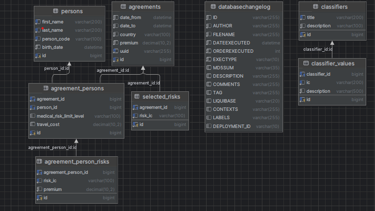
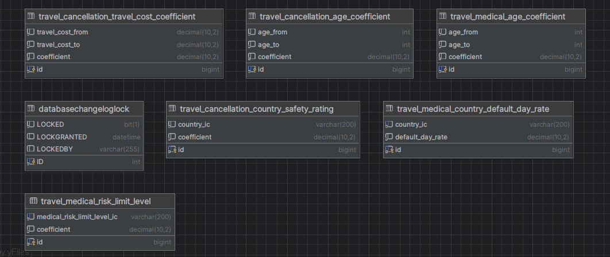

This project is a TRAVEL INSURANCE CALCULATOR.

Technologies used in this project: Spring, Hibernate, Gradle, MySql, H2, Liquibase, JUnit, Mockito, Thymeleaf, Logback and others.

Briefly about the project:

The agreement price is calculated based on many parameters,
such as the duration of agreement, the country, the age of each person,
the classification of agreement (for example only medical insurance or trip cancellation insurance and etc.),
insurance limit, trip cost and etc.

For each insurance classification formula is different.
Now only medical and cancellation risks are implemented.

For example, if you have an insurance which contains medical risk and travel cancellation risk,
your price will be calculated as the sum of prices for each risk: 

Medical risk price = age coefficient *  country coefficient * insurance limit coefficient * number of days.

Trip cancellation risk price = country coefficient * trip cost * age coefficient * number of days.

Age and country coefficient are different for each risk.
They are retrieved from database.

I used MySql database for my application and H2 for tests, but now the whole project is configured to use H2, so that you can run the application and test it by yourself.

Here is the diagram of the database:

You can see SQL script in src/test/resources/data.sql
src/test/resources/schema.sql
and there is also Liquibase script in src/main/resources/db.changelog as my app uses Liquibase.

There are controllers for such endpoints: 
http://localhost:8080/insurance/travel/api/v2/
this controller has a JSON response, so you can test it with Postman

http://localhost:8080//insurance/travel/web/v2
this controller has an HTML response, so you can test it in your browser

http://localhost:8080/insurance/travel/api/internal/agreement/{agreement_uuid}
this controller gets the uuid of agreement and if such agreement exists returns of the information about this agreement

